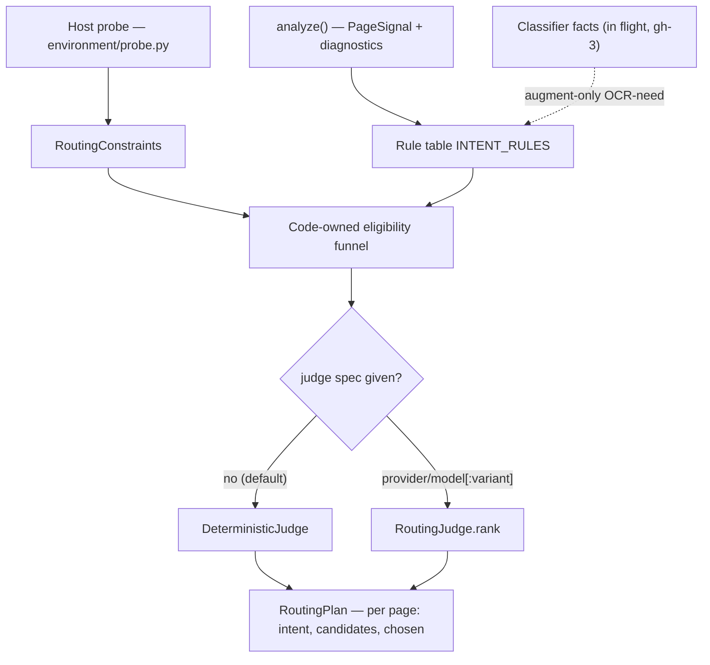

Auto mode is the default path of `parsecraft convert`: analyze first, decide
per page, then convert. The decision consumes four inputs — the host probe, a
fast complexity analysis, the deterministic rule table, and an optional
LLM-backed seam — and produces a `RoutingPlan` before any backend runs. This
page explains what each input contributes today, what is in flight, and which
knobs tune the outcome. Stage-by-stage mechanics live in
[Routing and auto mode](routing.md); the decision record is
[ADR-0004](../adr/0004-routing-and-auto-mode.md) (decisions 1–7 plus the
2026-10-01 amendment A1–A7).

Status labels used below: **current** (shipped and reachable today),
**in flight** (accepted design under active implementation, gh-3), **planned**
(agreed direction, nothing built).

## Hardware inputs

**Status:** current, except where marked planned.

Each CLI invocation probes the host once (`probe_environment()` in
`src/parsecraft/environment/probe.py`) and bridges the result into
`RoutingConstraints` (`constraints_from_environment()` in
`src/parsecraft/environment/constraints.py`):

| Input | How it is detected | How routing uses it |
| --- | --- | --- |
| Installed extras | `EXTRA_IMPORTS` map + `importlib.util.find_spec` — locates, never imports | `installed_extras`; a candidate whose `optional_dependency_group` is not installed is ineligible |
| GPU / VRAM budget | bounded `nvidia-smi --query-gpu=memory.total` call (10 s timeout, first GPU only; missing, failing, or malformed output → `0.0`) | `vram_budget_gb`; a GPU backend survives only when its declared estimate fits the measured budget |
| Offline state | `PARSECRAFT_OFFLINE`, operator-declared — connectivity is never probed | `offline`; excludes backends carrying a `model_asset` |
| OCR permission | derived from detected `ocr-*` extras; `--no-ocr` overrides | `allow_ocr`; when off, OCR intents may only degrade to native |
| Source formats | suffix → MIME via `MEDIA_TYPES` (`src/parsecraft/pipeline/analysis.py`) | `formats`; a candidate must cover every source MIME |
| Language (BCP-47) | caller-supplied, never derived | `language`; narrows only backends that *declare* `capabilities.languages` |

**CPU/GPU split.** Each descriptor declares `requires_gpu` and
`estimated_vram_gb` (`src/parsecraft/backends/protocol.py`);
`is_hard_eligible()` (`src/parsecraft/routing/rules.py`) keeps a GPU backend
only when `requires_gpu` is false or `estimated_vram_gb` is declared and
`<= vram_budget_gb`. Without a working `nvidia-smi` the budget is `0.0`, so
every GPU backend drops out while CPU backends keep routing the document.

Routing itself never probes hardware: descriptors *declare* what a backend can
do, the probe *detects* what this host has, and the planner reads both as plain
data.

**Deferred, not planned:** RAM and disk-speed probing were designed (2026-10-01)
and intentionally not built. Nothing consumes them: no backend declares a RAM
floor, so a probe would feed a field no rule reads. RAM probing has a written
design and a trigger — a registered backend declares a RAM floor that
eligibility actually checks. Disk-speed probing is rejected as a routing
input: it is a runtime side effect (I/O load, cache pollution) and cannot
yield honest cold-start numbers in-process; disk *capacity* is already
enforced where it matters (`InsufficientDiskSpaceError` before model
downloads). `EnvironmentInfo` carries only `backends`, `installed_extras`,
`vram_budget_gb`, and `offline`, and `RoutingConstraints` has no field that
could carry a RAM or disk figure.

## Fast complexity analysis

### What runs today

**Status:** current.

`analyze_source()` chooses the analyzer with `choose_analyzer()`
(`src/parsecraft/pipeline/analysis.py`): native backends first, then name
order, extras-aware. `DocumentBackend.analyze()` then produces an
`AnalysisResult` — source hash, page count, per-page signals, document
diagnostics — without converting any content.

Each `PageSignal` (`src/parsecraft/ir/models.py`) carries:

| Field | Meaning |
| --- | --- |
| `page_number` | 1-based page index |
| `has_native_text` | the page has extractable native text |
| `text_chars` | native text characters on the page |
| `image_count` | images on the page |
| `blank` | no content at all |
| `replacement_char_ratio` | share of U+FFFD garbage in the native text (`None` when not measured) |

`page_needs_ocr()` (`src/parsecraft/routing/rules.py`) is true when the page
is blank, has no native text, has fewer than `NATIVE_MIN_TEXT_CHARS` text
characters, or exceeds `MAX_REPLACEMENT_RATIO` replacement characters. The
thresholds are code-owned constants (ADR-0004 decision 2):

| Constant | Value | Effect |
| --- | --- | --- |
| `NATIVE_MIN_TEXT_CHARS` | 40 | thin pages route to OCR |
| `MAX_REPLACEMENT_RATIO` | 0.05 | garbled pages route to OCR |
| `HEAVY_IMAGE_COUNT` | 5 | document image mass ≥ 5 sets the figures hint |

Document-level flavor comes from `extract_hints()`: the diagnostic codes
`feature:tables`, `feature:equations`, `feature:figures`, plus image mass for
the figures hint. The rule table (`INTENT_RULES`) then selects the OCR flavor —
tables hint on a multi-page document → `OCR_TABLES`, equations/figures →
`OCR_VISION`, otherwise `OCR_GENERAL`.

**The hint channel is under-fed in production.** No production backend emits a
`feature:*` code; `native-pdf` is the only analyzer that emits analysis
diagnostics at all (`pdf-encrypted`, `pdf-no-extractable-text` — neither is a
feature hint), and the `feature:*` codes are synthesized only by tests. Real
documents therefore route on text statistics and image mass alone.

### Structural classifier facts

**Status:** in flight (gh-3; beads `pc-rzm` → `pc-1ow`).

The accepted design (ADR-0004 amendment A1–A5) adds a second optional seam
beside the judge: `detect_pdf` from the `pdf-inspector` extra reports
`pdf_type`, `confidence`, `pages_needing_ocr`, `pages_with_tables`, and
machine-readable OCR reasons. A pure fold (`apply_classifier()` in
`src/parsecraft/pipeline/analysis.py`) merges them at the analysis boundary;
`plan_route` keeps its signature and stays pure.

The merge is augment-only and asymmetric (A2):
`OCR-need = page_needs_ocr(signal) OR (signal.classifier_needs_ocr is True)`.
The classifier may add OCR-need, never remove it — a `text_based` verdict never
forces `NATIVE` on a page whose native text genuinely fails. With no classifier
or on classifier error, classification is exactly today's rule table; absence
*is* the current behavior (A3). The fold also emits a provenance diagnostic
(classifier name, upstream version, `pdf_type`, confidence) and fills
`feature:tables` from real table pages (A5, A6).

### Classifier cost profile

The classifier is a pure-Rust **text-layer structural scan**, tens of
milliseconds (≈20–100 ms), and loads **no models** — detection only. It runs
inside `analyze()` before any conversion is chosen, so its cost stays
negligible against the work it routes: native conversions cost ~ms–s and
docling/OCR conversions s–min. A classifier that loads an ML model to decide
whether to run an ML backend is out of contract (ADR-0004 A4; user decision
2026-10-01), so the answer to "isn't using ML to decide about ML oversized?"
is no — the decision is a scan, not a model.

### Language and domain slang

**Status:** current seam, planned extension.

`LanguageDetector` (`src/parsecraft/routing/language.py`) is built and opt-in:
the core only reads `RoutingConstraints.language` as plain data and never
imports a detector; the shipped ollaya-backed implementation lives in
`src/parsecraft/providers/ollaya.py` (`load_language_detector`), loaded only
when a caller asks for it. The request narrows only backends that declare
`capabilities.languages`; language-agnostic candidates are never excluded.

**Planned:** domain or slang analysis beyond this language detector — no
design or code exists for it.

## Hybrid per-page routing

**Status:** current — routing already operates per page at every stage.

- **Per-page intent.** `classify_page()` applies the single `INTENT_RULES`
  table to every `PageSignal` in page order; each page gets its own `Intent`
  (`NATIVE`, `OCR_GENERAL`, `OCR_TABLES`, `OCR_VISION`).
- **Per-page pass list.** Every `PageRoute` carries its own
  `candidates` list capped at `max_passes`, with `chosen = candidates[0]` and a
  human-readable `reason` (ADR-0004 decision 6). `RoutingPlan.primary` is the
  most-chosen backend across pages, tie-broken by name.
- **Code-owned eligibility.** Installed extras, VRAM budget, format coverage,
  `allow_ocr`, offline, language, and the intent family are filtered before any
  judge runs; a judge only re-ranks and can never widen the set — an
  ineligible, duplicate, or empty order raises `JudgeViolationError`
  (decisions 3–5).
- **Degradation mirror.** When an OCR-intent page finds no eligible OCR
  backend but still has native text, `plan_route` degrades it to `NATIVE` with
  a recorded reason and a `degraded-garbled-text` /
  `degraded-short-text` quality signal; genuinely blank pages keep raising
  `NoEligibleBackendError`, and a native-intent page is never silently routed
  to OCR.
- **Execution follows the plan.** `src/parsecraft/pipeline/executor.py` merges
  *contiguous* pages into one range only when they share
  `(intent, chosen, candidates)` and the backend declares
  `supports_page_ranges` and `supports_multi_page`; otherwise the page dispatches
  alone. Fallback candidates run in plan order on typed failure, one backend
  instance at a time, and total exhaustion is loud
  (`pipeline-all-passes-failed` warning, `winner=None`).

Grouping is an execution optimization only: the plan, the reasons, and the
fallback lists stay per page throughout.

## LLM access

The user decision behind this section (ADR-0004 A7): **a no-heuristic LLM path
must be configurable**, and the heuristic path remains the default whenever no
spec is given.

Neither seam is gated by `RoutingConstraints.offline`: that flag excludes
model-asset **backends** from candidacy (decision 3) and never blocks a provider
the caller named explicitly. A judge spec is the opt-in — judges may reach the
network (`systemone/jev` does) — while classifiers stay local-only by A4. No
provider is resolved at all unless a spec is given, so an offline-declared run
with no `--judge`/`--classifier` never leaves the process.

### Judge spec — ordering

**Status:** current, at library and CLI level.

`resolve_judge(spec)` (`src/parsecraft/routing/judge_providers.py`) accepts:

- `None` → `DeterministicJudge` (the unchanged default);
- a `RoutingJudge` instance → passthrough;
- a string → parsed as `provider/model[:variant]`
  (`parse_judge_spec` → `JudgeSpec`), then dispatched to a runtime-registered
  loader (`register_judge_provider`, last registration wins) or lazily
  imported from `parsecraft.providers.<provider>.load_judge(spec)` at resolve
  time only — never at module import, never inline.

Failures are typed: `JudgeSpecError` (malformed spec),
`JudgeProviderUnavailableError` (names the provider extra to install), and
`JudgeProviderLoadError` (loader failed or returned a non-judge). The
shipped judge providers are `ollaya/laya` (`src/parsecraft/providers/ollaya.py`),
a daemon-backed judge reading `OLLAYA_BASE_URL` at call time (default
`http://localhost:11435`), and `systemone/jev`
(`src/parsecraft/providers/systemone.py`), TypeSafe's System One API behind the
`systemone` extra and `TYPESAFE_API_KEY`.

CLI surface: `convert --backend NAME` leads every eligible page with `NAME`
through a CLI-owned `PreferredBackendJudge` (`--no-auto` requires `--backend`),
and `convert --judge SPEC` resolves the same spec strings here; auto mode with
neither flag uses `DeterministicJudge`. `--backend` and `--judge` are mutually
exclusive — both choose the lead candidate — a malformed spec exits `2`, and a
provider that cannot be loaded exits `1`.

### Classifier spec — OCR-need facts

**Status:** current, at library and CLI level.

`resolve_classifier(spec | instance | None)` (`src/parsecraft/routing/classifier.py`)
resolves `None → None` — unlike the judge, there is **no** default
implementation (A4), so absence is exactly the rule-table behaviour. A string is
parsed as `provider/model[:variant]` and dispatched to a runtime-registered
loader (`register_classifier_provider`, last registration wins) or lazily
imported from `parsecraft.providers.<provider>.load_classifier(spec)` at resolve
time only — never at module import, never inline. Failures are typed:
`ClassifierSpecError` (malformed spec), `ClassifierProviderUnavailableError`
(names the provider extra to install), and `ClassifierProviderLoadError` (loader
failed or returned a non-classifier); `analyze_source` falls back to the rule
table for `ClassifierError` only, and anything else propagates.

`parsecraft convert --classifier SPEC` folds the facts into the analysis before
routing. The one shipped provider is `pdfinspector/detect_pdf`
(`src/parsecraft/providers/pdfinspector.py`, needs the `pdf-inspector` extra):
pdf-inspector's detection scan — a local, model-free structural text-layer scan
of tens of milliseconds — taken 1-indexed and passed through verbatim into
IR-1-based facts, with `pdf_type`, `confidence`, and table pages feeding the
`feature:tables` hint.

### System One / Jev provider

**Status:** current for the judge seam (`systemone/jev`); a Jev-backed
classifier is not shipped.

ADR-0004 decision 7 and A7 make the judge seam the integration point for a
System One / Jev-backed judge. `src/parsecraft/providers/systemone.py`
implements it behind the optional `systemone` extra (`typesafe-sdk`, MIT, pure
Python): `load_judge` imports the SDK through `importlib` at resolve time only,
and requires `TYPESAFE_API_KEY` — an unset key or a missing extra raises
`JudgeProviderUnavailableError`, so the CLI exits `1` with `judge unavailable: …`
before any backend runs.

Each call asks ONE Choice question per page intent over the eligible candidates
(state: the intent plus the candidate names; criteria: each candidate's declared
capabilities), and the answer's probability distribution is the ranking — a
candidate the answer omits scores `0.0`, and ties keep the planner's name order,
so identical inputs give identical orders. The judge stays inside the code-owned
funnel: it only re-ranks what `plan_route` already found eligible (decisions
3-5). The model id is the spec's model token (`systemone/jev-latest`); a
`:variant` is rejected rather than ignored.

Without a configured spec the heuristic path is still the default: the
deterministic rule table plus, where configured, a judge spec.

## Tuning reference

| Knob | Where | Effect |
| --- | --- | --- |
| `--max-passes N` (default `1`) | `convert`, `inspect`, `benchmark` | caps `PageRoute.candidates`: `1` = no fallback pass, `N` = up to `N-1` ordered fallbacks per page |
| `--no-ocr` | `convert`, `inspect`, `benchmark` | `allow_ocr=False`: OCR intents degrade to native where the page still has native text, otherwise `NoEligibleBackendError` |
| `--backend NAME` / `--no-auto` | `convert` | non-auto lead: `NAME` first on every eligible page; `--no-auto` without `--backend` exits with code 2 |
| `PARSECRAFT_OFFLINE=1` | environment | offline constraint: backends carrying a `model_asset` are excluded |
| `--cache` | `convert` | content-addressed cache keyed on source bytes + registry fingerprint + canonical constraints + judge identity, so a changed knob naturally misses the old entry |
| `parsecraft inspect` | command | previews per-page signals, diagnostics, intent, chosen backend, candidates, and reason without converting; `--json` emits the same as JSON |
| judge / classifier spec | `resolve_judge` today; `--classifier` with gh-3 | swaps ordering (or OCR-need evidence) without touching the rules |
| thresholds `40` / `0.05` / `5` | `src/parsecraft/routing/rules.py` | code-owned constants, not config keys — tuning them is a code change with tests (ADR-0004 decision 2) |
| `RoutingConstraints.language` | library callers | BCP-47 narrowing of language-declaring backends; the detector is opt-in |

## Related

- [Routing and auto mode](routing.md) — stage mechanics, eligibility funnel,
  judge seam, execution details
- [ADR-0004](../adr/0004-routing-and-auto-mode.md) — decisions 1–7 and
  amendment A1–A7
- [CLI reference](../reference/cli.md) — command flags and exit codes
- [Backends](backends.md) — descriptor capabilities and the registry
