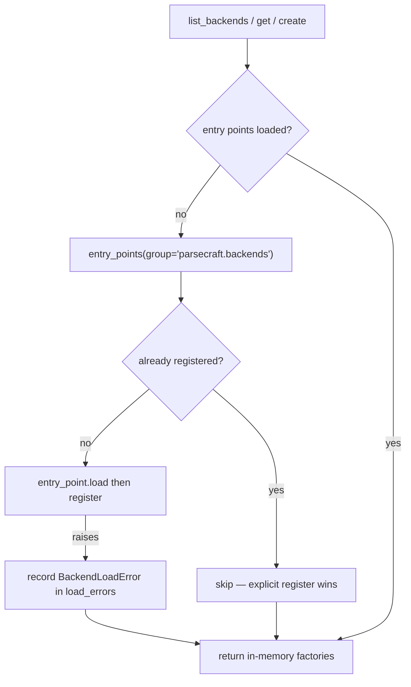

## Contract

A backend implements `DocumentBackend` and is created by a `BackendFactory`.
Both are `runtime_checkable` protocols in `parsecraft.backends.protocol`.

| Protocol | Members | Contract |
| -------- | ------- | -------- |
| `DocumentBackend` | `name`, `capabilities`, `analyze()`, `convert()` | Analyze a source; convert a bounded slice to `PageResult` blocks |
| `BackendFactory` | `descriptor`, `__call__(config)` | Carry a `BackendDescriptor`; build a backend. The only place heavy imports may happen |

`BackendDescriptor` is pure data — name and capabilities, no callable field.
The registry binds descriptor to factory internally, so descriptors serialize
cleanly for `parsecraft backends --json`.

## Request bounds

`ConversionRequest` carries every bound a backend must honor:

| Field | Purpose |
| ----- | ------- |
| `page_range` | Inclusive 1-based page slice |
| `region_ids` | Restrict conversion to detected regions |
| `timeout_s` | Wall-clock ceiling |
| `cancellation` | Callable polled for `True` |
| `max_output_chars` | Output character budget |
| `max_context_tokens` | Model context budget |

A backend that cannot meet a bound returns a typed `PassFailure` instead of
overrunning it.

## Registry and discovery

`BackendRegistry` maps names to factories. `default_registry` is the
process-wide instance the CLI uses.



Discovery rules:

- Triggers at most once per registry instance, on the first
  `list_backends()`/`get()`/`create()` call.
- Uses `importlib.metadata` only. Loading the entry-point module must stay
  light; instantiation (`create()`) is the first heavy-import boundary.
- Never raises. A broken plugin is recorded in `registry.load_errors` and
  skipped, so one bad plugin cannot brick the registry.
- An explicit `register()` always beats an entry point of the same name. The
  shadowed entry point is never loaded.
- `register()` validates the factory against `BackendFactory` and that
  `descriptor.name` matches the registration name.

## Entry-point group

Backends register under the frozen group name `parsecraft.backends`
(`ENTRY_POINT_GROUP` is the single definition). A distribution declares:

```toml
[project.entry-points."parsecraft.backends"]
my-backend = "my_package:factory"
```

## Error surface

| Error | Raised when |
| ----- | ----------- |
| `BackendNotFoundError` | `get()`/`create()` names an unregistered backend |
| `BackendAlreadyRegisteredError` | `register()` collides with an existing name |
| `BackendLoadError` | Recorded, not raised — a discovery failure stored in `load_errors` |

The CLI reads `load_errors` after listing and prints each failure to stderr, so
silent omission cannot happen. `parsecraft backends --json` still emits the
successfully loaded descriptors.

## Descriptors and capabilities

`BackendCapabilities` answers everything the CLI and a future planner need
without importing backend code: supported formats, page-range and multi-page
support, GPU requirement, estimated VRAM, the optional dependency group, and an
optional `ModelAssetDescriptor` (model id, revision, licences, acceptance flag,
size, quantization).

The registry `name` must match `^[a-z0-9][a-z0-9_-]*$`.

## Related pages

- [Backend catalog](../reference/backends.md) — in-package and external
  backends, licences, and route selection.
- [Write a backend](../guides/backend-authoring.md) — register your own.
