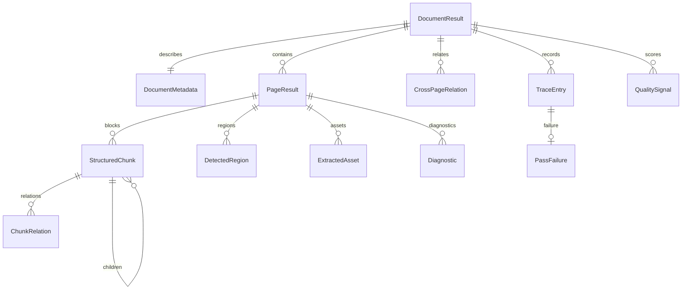

## Shape

`SCHEMA_VERSION` lives in `parsecraft.ir.models` and is `"1"`. Bump it on
breaking schema changes.

## Core types

| Type | Role |
| ---- | ---- |
| `DocumentResult` | Root of the IR: metadata, pages, relations, trace, quality |
| `DocumentMetadata` | Source URI, `sha256` source hash, format, page count, versions, timestamp |
| `PageResult` | One page: blocks in reading order, detected regions, assets, diagnostics |
| `StructuredChunk` | One typed content unit: `kind`, `content`, `page_number`, `reading_order`, `metadata` |
| `DetectedRegion` | A layout region (text, table, formula, figure, header, footer) |
| `ExtractedAsset` | An extracted image, LaTeX source, CSV, or other asset with optional `sha256` |
| `Diagnostic` | A recorded, non-fatal observation with a `level` and `code` |
| `PassFailure` | Typed failure record: code, pass kind, page range, backend, budget, elapsed, detail |
| `TraceEntry` | One recorded pass: kind, backend, status, page range, elapsed, settings, failure |

## Value objects

`BBox`, `SourceSpan`, `QualitySignal`, `ChunkRelation`, `PageRange`, and
`PassFailure` are frozen pydantic models. Each validates in a `model_validator`
and raises `ValidationError` on violation — none soft-returns or clamps.

## Enums

| Enum | Values |
| ---- | ------ |
| `ChunkKind` | `heading`, `paragraph`, `list`, `table`, `formula`, `code`, `figure`, `caption`, `header`, `footer`, `quote`, `unknown` |
| `PassKind` | `native`, `visual`, `repair`, `verify` |
| `PassStatus` | `ok`, `failed`, `skipped`, `cancelled` |
| `FailureCode` | `timeout`, `budget_exceeded`, `dependency_missing`, `gpu_insufficient`, `model_unavailable`, `cancelled`, `backend_error`, `invalid_input` |
| `RegionKind` | `text`, `table`, `formula`, `figure`, `header`, `footer` |
| `RelationKind` | `continuation`, `caption_of`, `cross_reference` |
| `DiagnosticLevel` | `info`, `warning`, `error` |
| `AssetKind` | `image`, `latex`, `csv`, `other` |

## Invariants

The model validators enforce these on construction:

| Type | Invariant |
| ---- | --------- |
| `BBox` | `x1 >= x0` and `y1 >= y0` |
| `SourceSpan` | `end >= start` |
| `PageRange` | `end >= start`, both `>= 1` |
| `PageResult` | Blocks are in ascending `reading_order`; every block's `page_number` matches the page |
| `TraceEntry` | `status == failed` if and only if `failure` is set |
| `DocumentResult` | Pages are unique and ascending; `metadata.page_count == len(pages)`; chunk ids are globally unique across nested children |

## Markdown projection

`parsecraft.ir.markdown` is in-house and dependency-free. Its byte output is the
contract consumers diff against, so the renderer stays in-package.

| `ChunkKind` | Projection |
| ----------- | ---------- |
| `heading` | `#` repeated by `metadata["heading_level"]` (default `2`, valid `1`–`6`) |
| `code` | Fenced block using `metadata["language"]` |
| `formula` | `$$` block |
| `quote` | Each line prefixed with `>` |
| `header` | `<!-- header: ... -->` comment |
| `footer` | `<!-- footer: ... -->` comment |
| all others | Content verbatim |

Projection rules:

- `render_page` emits a `<!-- page N -->` marker, then every block joined by a
  blank line; a page with no blocks renders the marker only.
- `to_markdown` joins pages with a blank line and appends a trailing newline.
  An empty document renders the empty string.
- No silent drops: every block of every page appears in the output. This is
  pinned by `test_no_silent_drops_every_content_appears`.
- Same input, byte-identical output. `test_projection_is_deterministic_across_calls`
  pins it.
