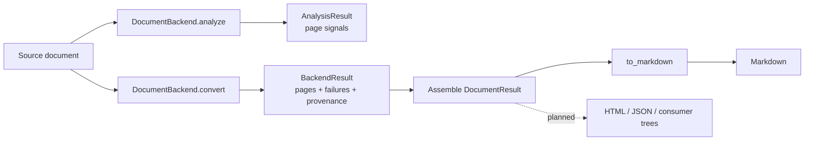

## What ParseCraft does

ParseCraft converts a document into typed structured chunks — the intermediate
representation (IR) — and projects the IR to deterministic Markdown. The IR is
the single source of truth; Markdown, HTML, JSON, and consumer trees are
projections of it.

## Data flow

`analyze()` collects deterministic page signals without converting content.
`convert()` turns a bounded slice (page range, region ids, timeout, budgets)
into `PageResult` blocks. The caller assembles a `DocumentResult` — metadata,
cross-page relations, and the processing trace — and the in-house renderer
projects it to Markdown.

!!! note "Assembly is a Phase 1 deliverable"
    Backends and the IR exist today. The layer that assembles
    `BackendResult` pages into a `DocumentResult` is not implemented yet; see
    the [IR reference](ir.md) for the types it will populate.

## Layers

| Layer | Module | Responsibility |
| ----- | ------ | -------------- |
| IR | `parsecraft.ir` | Canonical schema (`models.py`) and the deterministic projection (`markdown.py`) |
| Backends | `parsecraft.backends` | `DocumentBackend` / `BackendFactory` protocols, `BackendRegistry`, typed errors |
| CLI | `parsecraft.cli` | Typer app; lists backends and surfaces load errors |

The IR depends on nothing but pydantic. The backends layer depends on the IR.
The CLI depends on both. Nothing in the core imports a heavy runtime — model
weights, CUDA, vLLM, and OCR stacks load only inside a backend factory.

## Design principles

| Principle | Consequence |
| --------- | ----------- |
| IR is the source of truth | No module parses rendered Markdown back into state |
| Projection is deterministic | The same `DocumentResult` renders byte-identical Markdown |
| Failures are typed | A failed pass records a `PassFailure`, never a bare string |
| Discovery never raises | A broken plugin lands in `registry.load_errors` and stays visible |
| Core is offline-clean | `import parsecraft` performs no network or heavy imports |
| Extension without forks | Backends register through the public registry or an entry point |

## Extension points

Backends are the only extension surface. A third party declares the
`parsecraft.backends` entry-point group and ships a `BackendFactory`; no change
to this package is needed. See [Backends](backends.md) and the
[backend authoring guide](../guides/backend-authoring.md).

## Related pages

- [Intermediate representation](ir.md)
- [Backends](backends.md)
- [ADR-0001: Phase 0 decisions](../adr/0001-phase-0-decisions.md)
