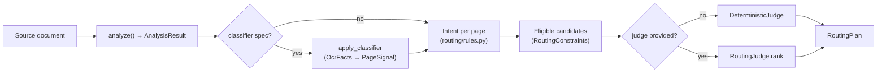
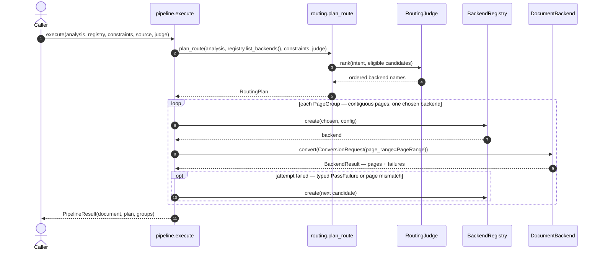
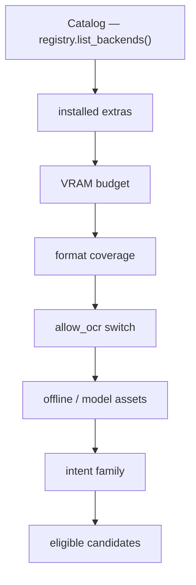
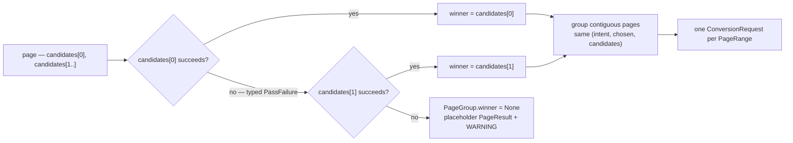

`parsecraft.routing` turns per-page analysis into a routing plan: which backend
runs on which page, and which fallbacks follow. Planning is a pure, deterministic
function; an optional judge may re-rank eligible candidates but never change the
rules. The decision is recorded in [ADR-0004](../adr/0004-routing-and-auto-mode.md).

## Pipeline



Analysis runs first and produces per-page signals. An optional classifier may
fold per-page OCR-need facts into those signals before classification
(`apply_classifier`; augment-only, so it can add OCR-need but never remove it).
Those signals then classify each page into an intent, constraints filter the
backend catalog to eligible candidates, and the judge orders them. The result is
a `RoutingPlan`.

## Execution flow

`parsecraft.pipeline` executes a plan. `execute()` plans and dispatches in one
call: it builds the plan itself, groups contiguous pages, converts each group
with its chosen backend, retries fallback candidates on typed failure, and
aggregates a `DocumentResult`.



## Execution API

Exported from `parsecraft.pipeline`: `PageGroup`, `PassAttempt`,
`PipelineResult`, `execute`.

```python
def execute(
    analysis: AnalysisResult,
    registry: BackendRegistry,
    constraints: RoutingConstraints,
    source: SourceDocument,
    judge: RoutingJudge | None = None,
    *,
    produced_at: datetime | None = None,
) -> PipelineResult
```

`execute` takes no `RoutingPlan` and no `ConversionRequest`: it calls
`plan_route` itself and builds one `ConversionRequest` per group.

| Type | Field | Type | Meaning |
| ---- | ----- | ---- | ------- |
| `PipelineResult` | `document` | `DocumentResult` | Aggregated IR document |
| `PipelineResult` | `plan` | `RoutingPlan` | The plan that was executed |
| `PipelineResult` | `groups` | `list[PageGroup]` | Dispatch groups with per-attempt records |
| `PageGroup` | `page_numbers` | `list[int]` | Contiguous pages in the group |
| `PageGroup` | `intent` | `Intent` | Shared intent |
| `PageGroup` | `candidates` | `list[str]` | Shared candidate order |
| `PageGroup` | `winner` | `str` or `None` | Backend that succeeded, `None` if every pass failed |
| `PageGroup` | `attempts` | `list[PassAttempt]` | Every attempt, in candidate order |
| `PassAttempt` | `backend` | `str` | Backend tried |
| `PassAttempt` | `status` | `PassStatus` | `ok` or `failed` |
| `PassAttempt` | `failure` | `PassFailure` or `None` | Typed failure when the attempt failed |

Aggregation builds `DocumentMetadata` (`source_uri`, `source_hash` from the
analysis, `format` from the source media type, `page_count`, `produced_at`) and
one `TraceEntry` per attempt, with `page_range` set to the group's range and
`pass_kind` native or visual by intent. An attempt that reports multiple
`PassFailure`s emits one trace entry per failure, while `PassAttempt.failure`
keeps the first.

## Signal to intent

`Intent` is a `StrEnum` with four members:

| Member | Value | Meaning |
| ------ | ----- | ------- |
| `NATIVE` | `native` | Native text is present and usable |
| `OCR_GENERAL` | `ocr` | OCR is needed; no table/figure hint |
| `OCR_TABLES` | `ocr-tables` | Multi-page document with a tables hint |
| `OCR_VISION` | `ocr-vision` | Equations or figure-heavy pages |

Per page, in order (constants live in `routing/rules.py`):

| Constant | Value | Use |
| -------- | ----- | --- |
| `NATIVE_MIN_TEXT_CHARS` | `40` | Below this, the page is treated as needing OCR |
| `MAX_REPLACEMENT_RATIO` | `0.05` | Above this replacement-character ratio, OCR |
| `HEAVY_IMAGE_COUNT` | `5` | Document image total that implies figure-heavy |

A page needs OCR when it is blank, has no native text, has fewer than
`NATIVE_MIN_TEXT_CHARS` characters, or has a replacement-character ratio above
`MAX_REPLACEMENT_RATIO`. An optional classifier can add OCR-need for a page
(`PageSignal.classifier_needs_ocr is True`) but never remove it: a `text_based`
verdict cannot force a page that fails the tests above onto `NATIVE` (see
[auto routing](auto-routing.md#classifier-spec--ocr-need-facts)). The OCR
flavor comes from document-level diagnostics
(`feature:tables`, `feature:equations`, `feature:figures`) or from
`sum(image_count) >= HEAVY_IMAGE_COUNT`:

1. Tables hint and `page_count > 1` → `OCR_TABLES`.
2. Equations or figures hint → `OCR_VISION`.
3. Otherwise → `OCR_GENERAL`.

Pages that do not need OCR route as `NATIVE`.

## Eligibility

A candidate is excluded from every `candidates` list unless it satisfies all
hard constraints. These are code-owned; a judge never sees an ineligible
backend.

| Rule | Excludes |
| ---- | -------- |
| Installed extras | `optional_dependency_group` not in `constraints.installed_extras` |
| VRAM budget | `gpu_requirement == 1.0` with `estimated_vram_gb` unset or greater than `vram_budget_gb`, or with no usable GPU (`gpu_usable=False`) |
| Format coverage | `constraints.formats` not fully covered by `supported_formats` |
| OCR switch | `allow_ocr=False` and the backend is an OCR backend |
| Offline | `offline=True` and the backend carries a `ModelAssetDescriptor` |
| Language | A candidate that declares a non-empty `languages` set, when the requested `language` is not in it |

Language narrows declarations, not the field: an empty `languages` tuple means
the backend makes no language claim, so a request can never disqualify it (see
[Language](#language-optional)).

The intent family is also fixed:

| Intent | Eligible family |
| ------ | --------------- |
| `NATIVE` | Eligible native backends lead, OCR backends are fallbacks. At least one eligible **non-OCR** backend is required |
| `OCR_GENERAL`, `OCR_TABLES`, `OCR_VISION` | OCR backends only |

A `NATIVE` page with native text but no eligible native backend for its format
(say a `text/csv` source with no CSV native backend) raises
`NoEligibleBackendError` with `intent=Intent.NATIVE` rather than routing a
native-intent page to OCR.

## Eligibility funnel



The filters run in this order. A backend that fails any stage never reaches the
judge; the funnel is the only path from catalog to candidates.

## Constraints

`RoutingConstraints` (`parsecraft.routing`) holds the hard limits. All fields are
code-owned at plan time and may be set per call.

| Field | Type | Default | Meaning |
| ----- | ---- | ------- | ------- |
| `formats` | `set[str]` | empty | Source formats the plan must serve; a candidate must cover all of them. Empty means no restriction |
| `installed_extras` | `set[str]` | empty | Extra names present in the environment |
| `vram_budget_gb` | `float` | `0.0` | VRAM ceiling (`ge=0`) |
| `max_passes` | `int` | `1` | Caps `len(PageRoute.candidates)` (`ge=1`) |
| `allow_ocr` | `bool` | `True` | When false, OCR backends are ineligible |
| `offline` | `bool` | `True` | When true, model-asset backends are ineligible |
| `language` | `str` or `None` | `None` | Requested BCP-47 document language; `None` places no language restriction |

## Language (optional)

Language is *declared* by backends and *requested* by the caller; the
deterministic core only reads the plain data and never detects anything itself.

| Layer | Field | Meaning |
| ----- | ----- | ------- |
| Declared | `BackendCapabilities.languages` | BCP-47 tags the backend claims; empty tuple = no claim (language-agnostic) |
| Requested | `RoutingConstraints.language` | BCP-47 tag for the document; `None` = unrestricted |

Eligibility only narrows a declaration: a candidate with a non-empty `languages`
set is excluded when the requested language is not in it, while an empty tuple is
never excluded — agnostic is the fail-safe direction, because set membership
cannot express broad coverage. Declared values (verified against model card
metadata, 2026-09-27): `ocr-tele` declares `zh` and `en`; `ocr-ovis`,
`ocr-unlimited`, `ocr-qianfan`, the native family, and `liteparse` are
language-agnostic (their cards say nothing, "multilingual", or claim broad
coverage).

Detection is an optional seam, like the judge. `parsecraft.routing.language`
defines `LanguageDetector` (`detect_language(text) -> str | None`); the core
never imports an implementation, and none ships — a caller implements the
protocol (or sets `RoutingConstraints.language` directly from configuration)
and hands the detector to the analysis. Pinned by
`tests/test_routing_language.py`: importing `parsecraft.routing` pulls no
provider module.

## Plan

`RoutingPlan` and `PageRoute` are pydantic models.

| Type | Field | Type | Meaning |
| ---- | ----- | ---- | ------- |
| `RoutingPlan` | `primary` | `str` | Winning backend across pages (mode; ties go to the lexicographically smallest name) |
| `RoutingPlan` | `pages` | `list[PageRoute]` | Ascending by `page_number`, at least one |
| `PageRoute` | `page_number` | `int` | Page (`ge=1`) |
| `PageRoute` | `intent` | `Intent` | Classified intent for the page |
| `PageRoute` | `candidates` | `list[str]` | Judge-ordered, at least one, truncated to `max_passes`; `candidates[0]` is the pass-1 route, the rest are fallbacks |
| `PageRoute` | `chosen` | `str` | Equal to `candidates[0]` (validated) |
| `PageRoute` | `reason` | `str` | Deterministic, human-readable justification |

A plan carries fallbacks as extra candidates; it does not carry execution
failures. Those are `PassFailure` records on the backend result.

## Per-page dispatch and fallbacks

Each page carries ordered candidates. `candidates[0]` is the pass-1 route and
`candidates[1..]` are fallback passes, tried only after a typed failure. Pages
with the same `(intent, chosen, candidates)` group into one range when the chosen
backend supports page ranges and multi-page conversion.



A group merges contiguous pages only when the chosen backend declares both
`supports_page_ranges` and `supports_multi_page`; otherwise each page converts
alone. When every candidate fails, each page gets a placeholder `PageResult`
with a `pipeline-all-passes-failed` warning diagnostic (constant
`ALL_PASSES_FAILED_CODE`) — no silent drops. If *no* page of the document
produced a block, the document also carries one `QualitySignal` of the same
name (`page_number=None`) and `pipeline_failure(document)` reports the verdict,
so `parsecraft convert` exits `1` with the diagnosis instead of returning an
empty document — a document with *some* content stays a success.

## Judge seam

`RoutingJudge` is a `runtime_checkable Protocol`:

```python
def rank(self, intent: Intent, candidates: Sequence[BackendDescriptor]) -> Sequence[str]
```

It receives only eligible candidates and returns backend names, best first. It
may re-rank or drop, but not add. `DeterministicJudge` is the default and orders
by:

1. Preferred model for the intent (`OCR_TABLES` → `ocr-unlimited`,
   `OCR_VISION` → `ocr-ovis`).
2. Native before OCR on the `NATIVE` intent.
3. Lowest `estimated_vram_gb` (`None` last).
4. Name, ascending.

When `judge=None`, `plan_route` uses `DeterministicJudge`, so routing never
requires a judge.

## Public API

```python
def plan_route(
    analysis: AnalysisResult,
    backends: Sequence[BackendDescriptor],
    constraints: RoutingConstraints,
    judge: RoutingJudge | None = None,
) -> RoutingPlan
```

Exported from `parsecraft.routing`: `DeterministicJudge`, `Intent`,
`JudgeViolationError`, `NoEligibleBackendError`, `PageRoute`,
`RoutingConstraints`, `RoutingError`, `RoutingJudge`, `RoutingPlan`,
`plan_route`.

| Error | Raised when |
| ----- | ----------- |
| `RoutingError` | Analysis has no signals |
| `NoEligibleBackendError` | No eligible candidate for an intent, or none at all; carries the `intent`, including `NATIVE` with only OCR candidates |
| `JudgeViolationError` | A judge returns an ineligible name, a duplicate, or an empty order |

## What routing does not see

Routing reads only what backends *declare* and what the caller passes in; it
never probes the machine. Host reality is *detected* once, in
`parsecraft.environment`, and distilled into `RoutingConstraints`.

| Fact | Declared — descriptor `capabilities` | Detected — `parsecraft.environment` |
| ---- | ------------------------------------ | ----------------------------------- |
| Backends present | — | `EnvironmentInfo.backends` |
| Installed extras | `optional_dependency_group` | `EnvironmentInfo.installed_extras` |
| GPU need and VRAM | `gpu_requirement` (0.0–1.0), `estimated_vram_gb` | `EnvironmentInfo.vram_budget_gb` — measured; `EnvironmentInfo.gpu_usable` — runtime can use it |
| Formats | `supported_formats` | — |
| Model assets | `model_asset` | — |
| Offline | — | `EnvironmentInfo.offline` — operator-declared |

`probe_environment() -> EnvironmentInfo` measures installed extras (resolve
only, never import), total GPU VRAM via `nvidia-smi`, and the operator-declared
`PARSECRAFT_OFFLINE` flag. It also reports `gpu_usable`: hardware presence is not
runtime capability, and a CPU-only torch build (`+cpu`, see
`cuda_runtime_note()`) means the planner must not send a GPU-required backend to
the CPU. `constraints_from_environment(environment, *,
formats=(), allow_ocr=None, max_passes=1) -> RoutingConstraints` fills every
constraint fields; with `allow_ocr=None` the switch is derived from whether an
`ocr-` extra is installed. Routing consumes the built constraints plus
descriptors and never probes hardware; the probe never judges eligibility.

Planning does not depend on probing: pass `RoutingConstraints` directly and
routing works.

**Language is declared, not detected.** Routing reads
`BackendCapabilities.languages` and `RoutingConstraints.language` as plain data
and never calls a detector; filling the request is the caller's job. See
[Language](#language-optional).

## Status

The routing engine (`parsecraft.routing`) and the executor
(`parsecraft.pipeline`) are implemented and exported, and wired into the CLI:
`convert --auto` (the default), `--backend`, `--preference`, `--max-passes`,
`--no-ocr`, `--judge` and `--classifier` are all current. The judge seam ships
three System One providers (see [Auto routing](auto-routing.md)). Still planned:
cancellation/timeout passthrough into `ConversionRequest`. Tracking bead:
`pc-5ub`.

Worked examples live in [Steer the auto-backend selector](../guides/auto-backend-selector.md).
