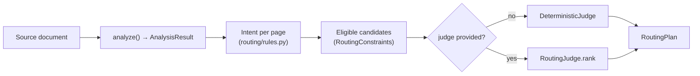

`parsecraft.routing` turns per-page analysis into a routing plan: which backend
runs on which page, and which fallbacks follow. Planning is a pure, deterministic
function; an optional judge may re-rank eligible candidates but never change the
rules. The decision is recorded in [ADR-0004](../adr/0004-routing-and-auto-mode.md).

## Pipeline



Analysis runs first and produces per-page signals. Those signals classify each
page into an intent, constraints filter the backend catalog to eligible
candidates, and the judge orders them. The result is a `RoutingPlan`.

## Signal to intent

`Intent` is a `StrEnum` with four members:

| Member | Value | Meaning |
| ------ | ----- | ------- |
| `NATIVE` | `native` | Native text is present and usable |
| `OCR_GENERAL` | `ocr` | OCR is needed; no table/figure hint |
| `OCR_TABLES` | `ocr-tables` | Multi-page document with a tables hint |
| `OCR_VISION` | `ocr-vision` | Equations or figure-heavy pages |

Per page, in order (constants live in `routing/rules.py`):

| Constant | Value | Use |
| -------- | ----- | --- |
| `NATIVE_MIN_TEXT_CHARS` | `40` | Below this, the page is treated as needing OCR |
| `MAX_REPLACEMENT_RATIO` | `0.05` | Above this replacement-character ratio, OCR |
| `HEAVY_IMAGE_COUNT` | `5` | Document image total that implies figure-heavy |

A page needs OCR when it is blank, has no native text, has fewer than
`NATIVE_MIN_TEXT_CHARS` characters, or has a replacement-character ratio above
`MAX_REPLACEMENT_RATIO`. The OCR flavor comes from document-level diagnostics
(`feature:tables`, `feature:equations`, `feature:figures`) or from
`sum(image_count) >= HEAVY_IMAGE_COUNT`:

1. Tables hint and `page_count > 1` → `OCR_TABLES`.
2. Equations or figures hint → `OCR_VISION`.
3. Otherwise → `OCR_GENERAL`.

Pages that do not need OCR route as `NATIVE`.

## Eligibility

A candidate is excluded from every `candidates` list unless it satisfies all
hard constraints. These are code-owned; a judge never sees an ineligible
backend.

| Rule | Excludes |
| ---- | -------- |
| Installed extras | `optional_dependency_group` not in `constraints.installed_extras` |
| VRAM budget | `requires_gpu` with `estimated_vram_gb` unset or greater than `vram_budget_gb` |
| Format coverage | `constraints.formats` not fully covered by `supported_formats` |
| OCR switch | `allow_ocr=False` and the backend is an OCR backend |
| Offline | `offline=True` and the backend carries a `ModelAssetDescriptor` |

The intent family is also fixed:

| Intent | Eligible family |
| ------ | --------------- |
| `NATIVE` | Eligible native backends lead, OCR backends are fallbacks. At least one eligible **non-OCR** backend is required |
| `OCR_GENERAL`, `OCR_TABLES`, `OCR_VISION` | OCR backends only |

A `NATIVE` page with native text but no eligible native backend for its format
(say a `text/csv` source with no CSV native backend) raises
`NoEligibleBackendError` with `intent=Intent.NATIVE` rather than routing a
native-intent page to OCR.

## Constraints

`RoutingConstraints` (`parsecraft.routing`) holds the hard limits. All fields are
code-owned at plan time and may be set per call.

| Field | Type | Default | Meaning |
| ----- | ---- | ------- | ------- |
| `formats` | `set[str]` | empty | Source formats the plan must serve; a candidate must cover all of them. Empty means no restriction |
| `installed_extras` | `set[str]` | empty | Extra names present in the environment |
| `vram_budget_gb` | `float` | `0.0` | VRAM ceiling (`ge=0`) |
| `max_passes` | `int` | `1` | Caps `len(PageRoute.candidates)` (`ge=1`) |
| `allow_ocr` | `bool` | `True` | When false, OCR backends are ineligible |
| `offline` | `bool` | `True` | When true, model-asset backends are ineligible |

## Plan

`RoutingPlan` and `PageRoute` are pydantic models.

| Type | Field | Type | Meaning |
| ---- | ----- | ---- | ------- |
| `RoutingPlan` | `primary` | `str` | Winning backend across pages (mode; ties go to the lexicographically smallest name) |
| `RoutingPlan` | `pages` | `list[PageRoute]` | Ascending by `page_number`, at least one |
| `PageRoute` | `page_number` | `int` | Page (`ge=1`) |
| `PageRoute` | `intent` | `Intent` | Classified intent for the page |
| `PageRoute` | `candidates` | `list[str]` | Judge-ordered, at least one, truncated to `max_passes`; `candidates[0]` is the pass-1 route, the rest are fallbacks |
| `PageRoute` | `chosen` | `str` | Equal to `candidates[0]` (validated) |
| `PageRoute` | `reason` | `str` | Deterministic, human-readable justification |

A plan carries fallbacks as extra candidates; it does not carry execution
failures. Those are `PassFailure` records on the backend result.

## Judge seam

`RoutingJudge` is a `runtime_checkable Protocol`:

```python
def rank(self, intent: Intent, candidates: Sequence[BackendDescriptor]) -> Sequence[str]
```

It receives only eligible candidates and returns backend names, best first. It
may re-rank or drop, but not add. `DeterministicJudge` is the default and orders
by:

1. Preferred model for the intent (`OCR_TABLES` → `ocr-unlimited`,
   `OCR_VISION` → `ocr-ovis`).
2. Native before OCR on the `NATIVE` intent.
3. Lowest `estimated_vram_gb` (`None` last).
4. Name, ascending.

When `judge=None`, `plan_route` uses `DeterministicJudge`, so routing never
requires a judge.

## Public API

```python
def plan_route(
    analysis: AnalysisResult,
    backends: Sequence[BackendDescriptor],
    constraints: RoutingConstraints,
    judge: RoutingJudge | None = None,
) -> RoutingPlan
```

Exported from `parsecraft.routing`: `DeterministicJudge`, `Intent`,
`JudgeViolationError`, `NoEligibleBackendError`, `PageRoute`,
`RoutingConstraints`, `RoutingError`, `RoutingJudge`, `RoutingPlan`,
`plan_route`.

| Error | Raised when |
| ----- | ----------- |
| `RoutingError` | Analysis has no signals |
| `NoEligibleBackendError` | No eligible candidate for an intent, or none at all; carries the `intent`, including `NATIVE` with only OCR candidates |
| `JudgeViolationError` | A judge returns an ineligible name, a duplicate, or an empty order |

## Status

The routing engine above is implemented in `parsecraft.routing`. Planned, not
implemented: a Jev / System One-backed `RoutingJudge` (the seam is the hook; it
would be an optional extra), per-range assignment instead of per-page, and
failure records inside the plan. Tracking bead: `pc-5ub`.
