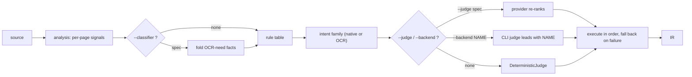

Every `parsecraft convert` decides **per page** which backend converts it. The
defaults need no flags: page signals select an intent, the rule table narrows the
catalog to that intent's family, and the first candidate that converts wins.
This page is for the runs where the defaults are not what you want.

The mechanics live in [Routing and auto mode](../architecture/routing.md) and
[Auto routing](../architecture/auto-routing.md); every flag and spec is listed in
the [CLI reference](../reference/cli.md).



`--judge` and `--backend` are mutually exclusive — both choose the lead
candidate. `--classifier` works with either, and with `--no-auto`.

## Preview the decision

`inspect` runs the cheapest analysis and prints the route it would take, without
converting content:

```bash
parsecraft inspect report.pdf
parsecraft inspect report.pdf --json
```

It previews the **default** plan (rule table plus the deterministic judge) and
forbids OCR with `--no-ocr`; it takes no `--judge`, `--classifier` or
`--preference`. When nothing is eligible it prints
`routing: unavailable — <reason>` and still exits `0`, because the analysis
itself succeeded.

## Rank differently inside the intent

`--preference` reorders candidates **within** the family the rules already
picked — it never moves a page to a different family:

```bash
parsecraft convert report.pdf --preference quality
parsecraft convert report.pdf --preference speed
```

| Axis | Effect inside the family |
| ---- | ------------------------ |
| `speed` / `balanced` | smallest declared VRAM first |
| `quality` | largest declared VRAM first (a documented proxy, not a quality score) |

`--preference` reaches the deterministic judge in auto mode and the resolved
`--judge` provider alike. `--backend` already names the lead, so the axis is
ignored there.

## Lead with one backend

Name the backend you want first, keeping the other eligible candidates as
fallbacks (a backend that cannot serve the source is a usage error, exit `2`):

```bash
parsecraft convert report.pdf --backend docling
parsecraft convert report.pdf --no-auto --backend native-pdf
```

## Let a judge order the candidates

A judge receives the page's intent and the eligible candidates — never the
document text — and returns an order. It is opt-in by naming a provider, and it
may use the network:

```bash
parsecraft judges                                  # providers, model tokens, credentials
parsecraft convert report.pdf --judge ollama/nimble          # local daemon, no credential
parsecraft convert report.pdf --judge zen/jev-1.13-free     # cloud, OPENCODE_API_KEY
parsecraft convert report.pdf --judge typesafe-ai/jev-latest # cloud, TYPESAFE_API_KEY
```

Both provider extras install in one step: `pip install "parsecraft[auto]"`
(the `systemone` judge stack plus the `pdf-inspector` classifier). It carries no
PDF or OCR backend — add those separately.

The spec is `provider/model[:variant]`: the provider token names **who serves**
the model, the model token is the upstream model id, and a `:variant` is
rejected rather than ignored. `parsecraft judges` is the live list — it reports
each provider's model tokens, its credential, the extra that ships it, and
whether this host currently has them:

```text
$ parsecraft judges
no --judge: the deterministic rule table decides; no provider is resolved and no network is used
typesafe-ai/jev-latest   TYPESAFE_API_KEY (unset)   extra systemone (missing)   SDK default base URL
zen/jev-1.13-free        OPENCODE_API_KEY (unset)   extra systemone (missing)   https://opencode.ai/zen
ollama/<model>           no credential              extra systemone (missing)   http://localhost:11434
                         verified local models: nimble, tev
```

Export the credential before the run; a missing key or extra is a typed failure
(exit `1`, `judge unavailable: …`) before any backend converts anything. The
three shipped providers share one System One implementation and one extra
(`systemone`, `typesafe-sdk`):

| Provider | Serves | Credential |
| -------- | ------ | ---------- |
| `typesafe-ai/<model>` | the TypeSafe cloud (System One models) | `TYPESAFE_API_KEY` |
| `zen/<model>` | OpenCode Zen, same wire | `OPENCODE_API_KEY` (`-free` model: no billing) |
| `ollama/<model>` | a local Ollama daemon | none |

`ollama/<model>` needs a scoring-capable local GGUF (`nimble`, `tev`) and
ollama ≥ 0.35. Its tag form is unusable — `ollama/nimble:latest` parses as a
variant — which is harmless, because a bare `nimble` resolves to `:latest`.

## Add OCR-need facts before routing

The classifier runs during **analysis**, before any routing decision, and can
only *add* OCR-need to a page:

```bash
parsecraft convert scan.pdf --classifier pdfinspector/detect_pdf
```

`pdfinspector/detect_pdf` is the shipped provider: a local, model-free
text-layer scan (needs the `pdf-inspector` extra). It is purely augmenting — a
rule-table OCR verdict is never cleared — and it works in auto mode and under
`--no-auto`, because the fold happens before routing.

## Constrain the run

| Flag | Effect |
| ---- | ------ |
| `--no-ocr` | forbid OCR backends, wherever a spec or judge would send a page |
| `--max-passes N` | how many candidates per page are tried before the page fails |
| `--cache` / `--no-cache` | reuse the content-addressed conversion cache (the key includes the judge identity) |
| `--verbose` | keep third-party library output (progress bars, tokenizer and generation advisories); by default it is suppressed, never our own messages |

## When it fails

| Exit | Meaning |
| ---- | ------- |
| `0` | success (including `inspect` with no eligible backend) |
| `1` | analysis or routing failed: a missing extra, an unset credential, an unavailable `--judge`/`--classifier` provider, no eligible backend, or a page whose intent has no eligible family (an OCR page with no OCR backend that can run here) |
| `2` | usage error: malformed spec, `--backend` combined with `--judge`, `--no-auto` without `--backend`, ineligible `--backend`, a judge that crosses the native/OCR boundary, unsupported suffix |

A GPU is only usable when the *runtime* can use it: a card with a CPU-only torch
build (`torch.cuda.is_available()` is `False`) warns once on stderr
(`GPU detected but unusable: … — GPU-only backends are excluded`) and every
GPU-only backend drops out of the plan, which is why an OCR page can fail with
`no eligible backend for intent 'ocr'` on such a host.

## What the selector will not do

- A judge cannot widen the candidate set: it re-ranks only what the hard
  constraints already admitted. A name outside that set, a duplicate, or an
  empty order is a violation (exit `2`).
- Families are never crossed: a page the rules called **native** is never
  silently handed to an OCR backend — not by the planner, and not by a judge
  either (an order that promotes an OCR fallback above a native candidate is
  rejected). If OCR is required and no native backend covers the format, routing
  fails instead.
- A classifier cannot remove OCR-need, and it cannot see the document as the
  judge does — it reports per-page facts (OCR-need, tables) and a document type.

## Related pages

- [Routing and auto mode](../architecture/routing.md) — the funnel, eligibility, and dispatch mechanics.
- [Auto routing](../architecture/auto-routing.md) — hardware inputs, the rule table's thresholds, the classifier's cost profile, the provider contracts.
- [CLI reference](../reference/cli.md) — every flag default and the spec tables.
- [Backends](../reference/backends.md) — what each candidate can serve, and its cost class.
